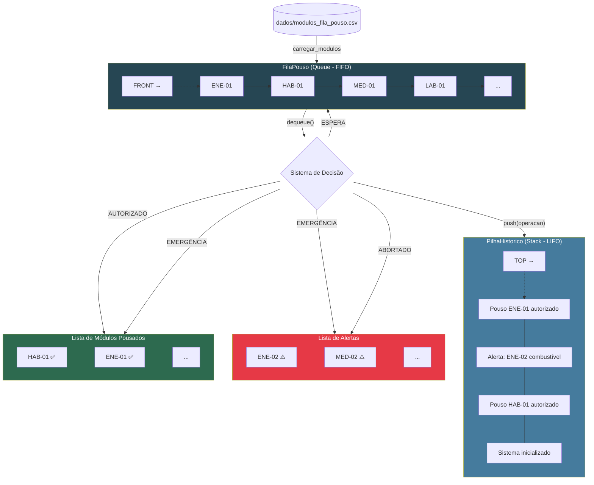
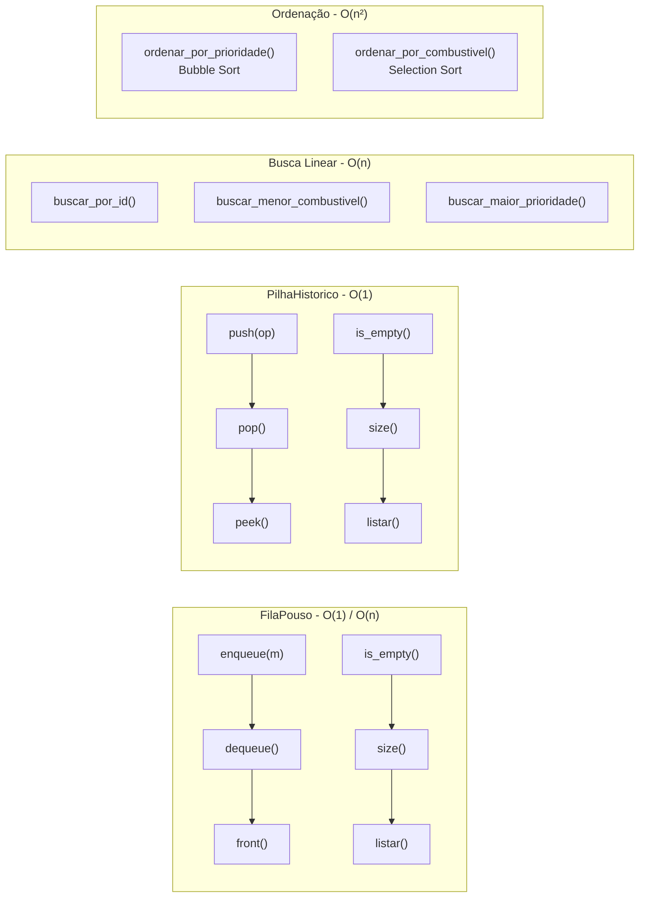

# Diagrama de Estruturas de Dados - MGPEB

## Visão Geral das Estruturas e Fluxo de Dados

```mermaid
flowchart TD
    CSV[(dados/modulos_fila_pouso.csv)] -->|carregar_modulos| FILA

    subgraph FILA ["FilaPouso (Queue - FIFO)"]
        direction LR
        F1[ENE-01] --> F2[HAB-01] --> F3[MED-01] --> F4[LAB-01] --> F5["..."]
        FRONT["FRONT →"] -.-> F1
    end

    FILA -->|"dequeue()"| DECISAO{Sistema de Decisão}
    
    DECISAO -->|AUTORIZADO| POUSADOS
    DECISAO -->|EMERGÊNCIA| POUSADOS
    DECISAO -->|EMERGÊNCIA| ALERTAS
    DECISAO -->|ABORTADO| ALERTAS
    DECISAO -->|ESPERA| FILA

    subgraph POUSADOS ["Lista de Módulos Pousados"]
        direction LR
        P1["HAB-01 ✅"] ~~~ P2["ENE-01 ✅"] ~~~ P3["..."]
    end

    subgraph ALERTAS ["Lista de Alertas"]
        direction LR
        A1["ENE-02 ⚠️"] ~~~ A2["MED-02 ⚠️"] ~~~ A3["..."]
    end

    DECISAO -->|"push(operacao)"| PILHA

    subgraph PILHA ["PilhaHistorico (Stack - LIFO)"]
        direction TB
        TOP["TOP →"] -.-> S1
        S1["Pouso ENE-01 autorizado"]
        S2["Alerta: ENE-02 combustível"]
        S3["Pouso HAB-01 autorizado"]
        S4["Sistema inicializado"]
        S1 --- S2 --- S3 --- S4
    end

    style FILA fill:#264653,color:#fff
    style POUSADOS fill:#2d6a4f,color:#fff
    style ALERTAS fill:#e63946,color:#fff
    style PILHA fill:#457b9d,color:#fff
```

## Operações por Estrutura

```mermaid
flowchart LR
    subgraph FILA_OPS ["FilaPouso - O(1) / O(n)"]
        E1["enqueue(m)"] --> E2["dequeue()"] --> E3["front()"]
        E4["is_empty()"] --> E5["size()"] --> E6["listar()"]
    end

    subgraph PILHA_OPS ["PilhaHistorico - O(1)"]
        P1["push(op)"] --> P2["pop()"] --> P3["peek()"]
        P4["is_empty()"] --> P5["size()"] --> P6["listar()"]
    end

    subgraph BUSCA_OPS ["Busca Linear - O(n)"]
        B1["buscar_por_id()"]
        B2["buscar_menor_combustivel()"]
        B3["buscar_maior_prioridade()"]
    end

    subgraph SORT_OPS ["Ordenação - O(n²)"]
        S1["ordenar_por_prioridade()
        Bubble Sort"]
        S2["ordenar_por_combustivel()
        Selection Sort"]
    end
```
