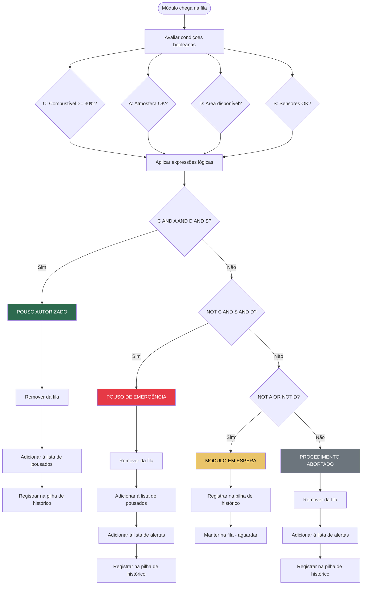

# Fluxograma do Sistema de Decisão de Pouso

```mermaid
flowchart TD
    START([Módulo chega na fila]) --> EVAL[Avaliar condições booleanas]
    
    EVAL --> C{C: Combustível >= 30%?}
    EVAL --> A{A: Atmosfera OK?}
    EVAL --> D{D: Área disponível?}
    EVAL --> S{S: Sensores OK?}
    
    C --> LOGIC[Aplicar expressões lógicas]
    A --> LOGIC
    D --> LOGIC
    S --> LOGIC
    
    LOGIC --> CHECK_AUTO{C AND A AND D AND S?}
    
    CHECK_AUTO -->|Sim| AUTORIZADO[POUSO AUTORIZADO]
    CHECK_AUTO -->|Não| CHECK_EMERG{NOT C AND S AND D?}
    
    CHECK_EMERG -->|Sim| EMERGENCIA[POUSO DE EMERGÊNCIA]
    CHECK_EMERG -->|Não| CHECK_ESPERA{NOT A OR NOT D?}
    
    CHECK_ESPERA -->|Sim| ESPERA[MÓDULO EM ESPERA]
    CHECK_ESPERA -->|Não| ABORTADO[PROCEDIMENTO ABORTADO]
    
    AUTORIZADO --> FILA_OUT[Remover da fila]
    FILA_OUT --> POUSADOS[Adicionar à lista de pousados]
    POUSADOS --> PILHA_OK[Registrar na pilha de histórico]
    
    EMERGENCIA --> FILA_OUT2[Remover da fila]
    FILA_OUT2 --> POUSADOS2[Adicionar à lista de pousados]
    POUSADOS2 --> ALERTAS[Adicionar à lista de alertas]
    ALERTAS --> PILHA_EMERG[Registrar na pilha de histórico]
    
    ESPERA --> PILHA_ESPERA[Registrar na pilha de histórico]
    PILHA_ESPERA --> MANTER[Manter na fila - aguardar]
    
    ABORTADO --> FILA_OUT3[Remover da fila]
    FILA_OUT3 --> ALERTAS2[Adicionar à lista de alertas]
    ALERTAS2 --> PILHA_ABORT[Registrar na pilha de histórico]

    style AUTORIZADO fill:#2d6a4f,color:#fff
    style EMERGENCIA fill:#e63946,color:#fff
    style ESPERA fill:#e9c46a,color:#000
    style ABORTADO fill:#6c757d,color:#fff
```
