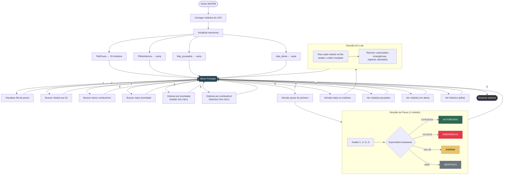
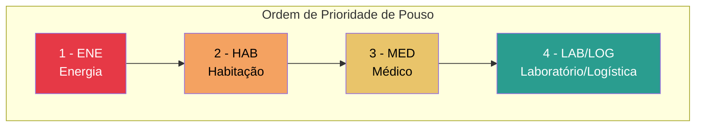

# Fluxograma do Sistema Completo - MGPEB

```mermaid
flowchart TD
    START([Iniciar MGPEB]) --> LOAD[Carregar módulos do CSV]
    LOAD --> INIT[Inicializar estruturas]
    
    INIT --> FILA_INIT["FilaPouso ← 20 módulos"]
    INIT --> PILHA_INIT["PilhaHistorico ← vazia"]
    INIT --> LISTA_POUS["lista_pousados ← vazia"]
    INIT --> LISTA_ALERT["lista_alerta ← vazia"]
    
    FILA_INIT --> MENU
    PILHA_INIT --> MENU
    LISTA_POUS --> MENU
    LISTA_ALERT --> MENU
    
    MENU{{"Menu Principal"}}
    
    MENU -->|1| VER_FILA["Visualizar fila de pouso"]
    MENU -->|2| BUSCA_ID["Buscar módulo por ID"]
    MENU -->|3| BUSCA_COMB["Buscar menor combustível"]
    MENU -->|4| BUSCA_PRIO["Buscar maior prioridade"]
    MENU -->|5| ORD_PRIO["Ordenar por prioridade
    Bubble Sort O(n²)"]
    MENU -->|6| ORD_COMB["Ordenar por combustível
    Selection Sort O(n²)"]
    MENU -->|7| SIM_PROX["Simular pouso do próximo"]
    MENU -->|8| SIM_TODOS["Simular todos os módulos"]
    MENU -->|9| VER_POUS["Ver módulos pousados"]
    MENU -->|10| VER_ALERT["Ver módulos em alerta"]
    MENU -->|11| VER_HIST["Ver histórico (pilha)"]
    MENU -->|0| FIM([Encerrar sistema])
    
    VER_FILA --> MENU
    BUSCA_ID --> MENU
    BUSCA_COMB --> MENU
    BUSCA_PRIO --> MENU
    ORD_PRIO --> MENU
    ORD_COMB --> MENU
    VER_POUS --> MENU
    VER_ALERT --> MENU
    VER_HIST --> MENU
    
    SIM_PROX --> DECISAO
    SIM_TODOS --> DECISAO_BATCH

    subgraph DECISAO ["Decisão de Pouso (1 módulo)"]
        D_EVAL["Avaliar C, A, D, S"] --> D_CHECK{Expressões booleanas}
        D_CHECK -->|"C∧A∧D∧S"| D_AUTO[AUTORIZADO]
        D_CHECK -->|"¬C∧S∧D"| D_EMERG[EMERGÊNCIA]
        D_CHECK -->|"¬A∨¬D"| D_ESPERA[ESPERA]
        D_CHECK -->|outro| D_ABORT[ABORTADO]
    end
    
    subgraph DECISAO_BATCH ["Decisão em Lote"]
        DB1["Para cada módulo na fila:
        avaliar e exibir resultado"]
        DB1 --> DB2["Resumo: autorizados,
        emergências, esperas, abortados"]
    end
    
    DECISAO --> MENU
    DECISAO_BATCH --> MENU

    style MENU fill:#264653,color:#fff
    style D_AUTO fill:#2d6a4f,color:#fff
    style D_EMERG fill:#e63946,color:#fff
    style D_ESPERA fill:#e9c46a,color:#000
    style D_ABORT fill:#6c757d,color:#fff
    style FIM fill:#333,color:#fff
```

## Prioridades de Pouso

```mermaid
flowchart LR
    subgraph PRIORIDADES ["Ordem de Prioridade de Pouso"]
        direction LR
        P1["1 - ENE
        Energia"] --> P2["2 - HAB
        Habitação"] --> P3["3 - MED
        Médico"] --> P4["4 - LAB/LOG
        Laboratório/Logística"]
    end
    
    style P1 fill:#e63946,color:#fff
    style P2 fill:#f4a261,color:#000
    style P3 fill:#e9c46a,color:#000
    style P4 fill:#2a9d8f,color:#fff
```
