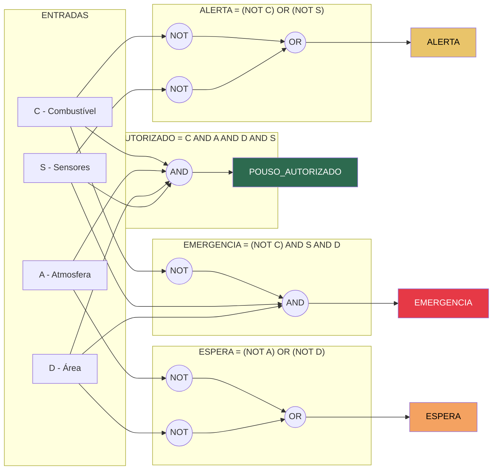

# Diagrama de Portas Lógicas - Sistema de Decisão MGPEB

## Variáveis de Entrada

| Variável | Descrição | Condição para 1 |
|----------|-----------|-----------------|
| C | Combustível suficiente | combustível >= 30% |
| A | Atmosfera OK | sem tempestade |
| D | Área disponível | slot livre |
| S | Sensores operacionais | integridade = 1 |

## Expressões Booleanas e Portas Lógicas

## Tabela-Verdade Resumida (casos chave)

| C | A | D | S | AUTORIZADO | ALERTA | EMERGÊNCIA | ESPERA |
|---|---|---|---|:---:|:---:|:---:|:---:|
| 1 | 1 | 1 | 1 | **1** | 0 | 0 | 0 |
| 0 | 1 | 1 | 1 | 0 | **1** | **1** | 0 |
| 1 | 0 | 1 | 1 | 0 | 0 | 0 | **1** |
| 1 | 1 | 0 | 1 | 0 | 0 | 0 | **1** |
| 1 | 1 | 1 | 0 | 0 | **1** | 0 | 0 |
| 0 | 1 | 0 | 1 | 0 | **1** | 0 | **1** |
| 0 | 0 | 1 | 0 | 0 | **1** | 0 | **1** |
